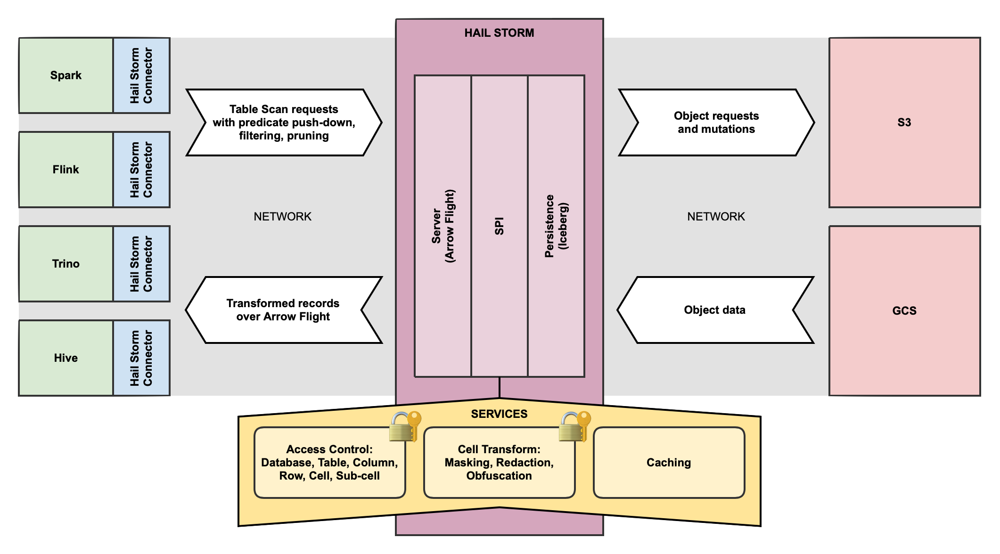

# Hail Storm
An extensible record-based data delivery service for very large datasets.

## Goals
Provide a common data access/mutation layer where cross-cutting security concerns can be sensibly implemented.

## Problem
One of the positive outcomes of the data mesh architecture is the greater ability for data to be shared
across organisations and to be consumed in ways dictated by the consumers and not the producers. However,
this desire highlights key security deficiencies that exist today in our data platforms. To date,
fine-grained data security is implemented at the edge — at the point of consumption. In world of
heterogeneous consumers that means it is implemented multiple times with inevitable divergence. For a
producer to secure their data, they must trust **ALL** consumer platforms. While this is possible in a
fully integrated, centralised data platform, it is completely at odds with the ideals of the data mesh
architecture.

## Solution
To fix this, we need to push the implementation of data security back to the data serving endpoints made
available by producers. This is feasible with bespoke API endpoints (REST/GQL), but realistically, for
very large-scale datasets this does not make sense. In this realm we currently expose data using an
object store model (S3/GCS); this is sufficient for coarse-grained database and table access controls.
However, column, row, cell, and sub-cell access controls are real requirements, and these are not
satisfied by object stores. To address this we propose introducing a new integration layer fulfilled
by **record servers**, implemented using modern, open, and scalable data standards (Arrow Flight/Iceberg).
This new layer provides the correct level of abstraction to implement fine-grained data access controls
and also richer capabilities such as data masking, redaction, and obfuscation.

## Architecture

## References
* [Apache Arrow Flight](https://arrow.apache.org/docs/format/Flight.html)
* [Apache Iceberg](https://iceberg.apache.org)

The decisions for this tool are recorded as [architecture decision records in the project repository](doc/adr/). 

